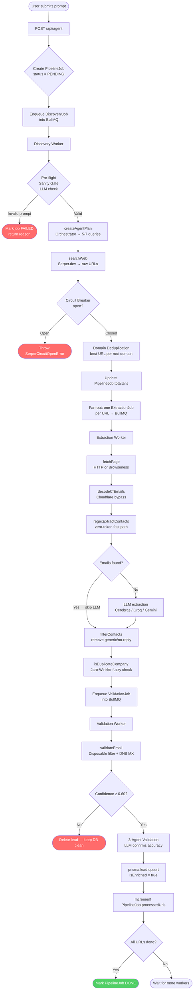
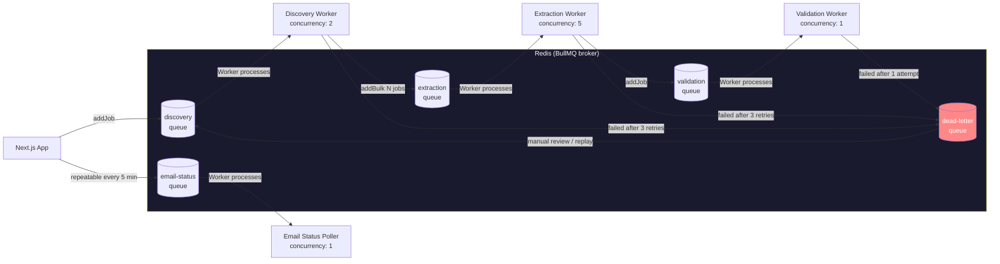
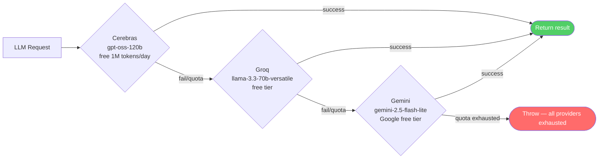
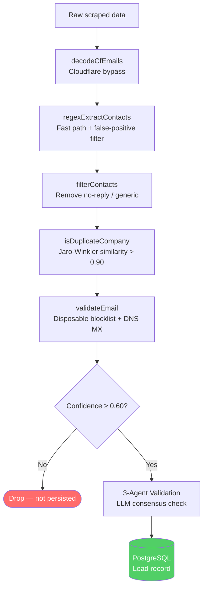

# HyperDrive AI — Architecture

> **Pipeline**: User Prompt → Discovery Worker → Extraction Worker → Validation Worker → PostgreSQL

---

## Table of Contents

1. [System Overview](#system-overview)
2. [Full Pipeline Flowchart](#full-pipeline-flowchart)
3. [BullMQ Queue Topology](#bullmq-queue-topology)
4. [Worker Responsibilities](#worker-responsibilities)
5. [AI Cascade: Cerebras → Groq → Gemini](#ai-cascade)
6. [Data Quality Layer](#data-quality-layer)
7. [Infrastructure Resilience](#infrastructure-resilience)

---

## System Overview

HyperDrive AI is a **multi-stage async pipeline** that converts a natural language lead-generation prompt into a verified list of B2B contacts stored in a PostgreSQL database. The pipeline is fully decoupled via BullMQ queues backed by Redis, meaning each stage scales independently and failures in one stage don't block the others.

```
User Browser
    │  POST /api/agent  { prompt }
    ▼
Next.js App Server
    │  Creates PipelineJob (status=PENDING) in PostgreSQL
    │  Enqueues DiscoveryJob in BullMQ
    ▼
Redis (BullMQ)  ◄──────────────────────────────────────────────────────┐
    │                                                                   │
    ▼                                                               DLQ (Dead Letter Queue)
BullMQ Workers (separate Docker container)                             │
    │                                                                   │
    ├─ Discovery Worker  ─► Extraction Worker  ─► Validation Worker ──►┘
    │
    ├─ Email Status Poller  (repeatable heartbeat, every 5 min)
    │
    ▼
PostgreSQL  (PipelineJob + Lead + EmailLog records)
```

Clients poll `GET /api/agent/status?jobId=<id>` for real-time progress. No webhooks are required for local or Docker deployments.

---

## Full Pipeline Flowchart



---

## BullMQ Queue Topology



### Queue Configuration

| Queue | Concurrency | Retries | Backoff |
|---|---|---|---|
| `discovery` | 2 | 3 | 5s exponential |
| `extraction` | 5 | 3 | 5s exponential |
| `validation` | 1 | 1 (best-effort) | — |
| `email-status` | 1 | 1 | Repeatable every 5 min |
| `dlq` | — | 0 (terminal) | — |

> **Why validation concurrency is 1:** Each validation job runs 3 sequential LLM calls (Criteria → Intent → Quality agents). Concurrency > 1 would cause 3× API quota burn simultaneously. A 3-second cooldown is enforced between jobs to further protect token budgets.

---

## Worker Responsibilities

### 1. Discovery Worker (`discovery.worker.ts`)

**Input:** `{ jobId, workspaceId, prompt, userId }`

**Responsibilities:**
1. **Pre-flight sanity gate** — lightweight LLM call classifies the prompt as real/valid or fictional/gibberish. Blocks nonsensical prompts before any paid API is called.
2. **Orchestration** — calls `createAgentPlan()` to translate the prompt into 5–7 diverse Google-style search queries.
3. **Web search** — calls `searchWeb()` (Serper.dev) for each query to collect target URLs.
4. **Domain deduplication** — keeps only the best URL per root domain (priority: `/contact` > `/about` > `/team` > homepage). Reduces token usage ~40%.
5. **Fan-out** — enqueues one `ExtractionJob` per URL into the BullMQ extraction queue.

**Output:** N extraction jobs in `extractionQueue`.

---

### 2. Extraction Worker (`extraction.worker.ts`)

**Input:** `{ jobId, workspaceId, url, targetCriteria }`

**Responsibilities:**
1. **Page fetch** — HTTP fetch with a real browser UA. Falls back to Browserless (headless Chrome) for JS-rendered sites.
2. **Cloudflare bypass** — calls `decodeCfEmails()` to decode `data-cfemail` obfuscated emails before regex runs.
3. **Regex extraction** — `regexExtractContacts()` zero-latency fast path. If emails found, LLM step is skipped.
4. **LLM extraction** — if regex finds nothing, sends the page text to the AI cascade for structured extraction.
5. **Contact filtering** — `filterContacts()` removes generic/no-reply addresses and duplicate emails.
6. **Company deduplication** — `isDuplicateCompany()` uses Jaro-Winkler fuzzy matching to prevent same-company duplicates across a workspace.
7. **Enqueue validation** — one `ValidationJob` per extracted contact.

**Output:** N validation jobs in `validationQueue`.

---

### 3. Validation Worker (`validation.worker.ts`)

**Input:** `{ jobId, workspaceId, leadId, sourceUrl, filteredText, targetCriteria }`

**Responsibilities:**
1. **Email MX validation** — `validateEmail()` checks disposable domain blocklist + DNS MX record lookup. Drops leads with confidence < 0.60.
2. **3-Agent validation** — three independent LLM calls (Criteria, Intent, Quality agents) each score the lead's accuracy. Agents run **sequentially** to minimise token quota burn. Only leads with Criteria + Quality consensus are approved; Intent is a scoring bonus.
3. **Anti-hallucination guard** — each agent citation is verified to exist verbatim in the source text before counting toward approval.
4. **Database persistence** — `prisma.lead.update()` with `isEnriched: true` for approved leads.
5. **Job completion tracking** — atomically decrements `pendingValidations`. When `pendingValidations <= 0` and `processedUrls >= totalUrls`, marks `PipelineJob` as `DONE` via a raw SQL compare-and-swap to prevent race conditions.

**Output:** Verified `Lead` record in PostgreSQL.

---

### 4. Email Status Poller (`email-status.worker.ts`)

**Input:** `{ triggeredAt }` — periodic heartbeat payload (no user data)

**Responsibilities:**
1. **Repeatable job** — BullMQ registers a repeatable job on startup that fires every **5 minutes**. No external cron or webhook URL required.
2. **Query** — fetches all `EmailLog` records with status `SENT`, `DELIVERED`, or `OPENED` that have a valid `resendId` and were sent within the last 7 days. Capped at 50 records per cycle to stay within Resend rate limits.
3. **Poll Resend API** — calls `GET /emails/{resendId}` for each log using the user's BYOK Resend key (decrypted from AES-256-GCM storage) or the platform fallback key.
4. **Status update** — updates `EmailLog.status` only when the new status is higher in the lifecycle (`SENT → DELIVERED → OPENED → CLICKED`). Prevents regression on concurrent polls.
5. **Auto-unsubscribe** — if `COMPLAINED` is detected, the recipient email is automatically added to the workspace `Unsubscribe` table.
6. **Campaign completion** — when all emails in a campaign reach a terminal status, marks the campaign `COMPLETED`.

**Output:** Updated `EmailLog` records in PostgreSQL. Replaces the need for Resend webhooks on self-hosted / localhost deployments.

---

## AI Cascade

The AI cascade provides automatic failover across three LLM providers. Each provider is tried in order; on failure or quota exhaustion, the next is attempted.



### Provider Details

| Provider | Model | Free Tier | Primary Use |
|---|---|---|---|
| Cerebras | `gpt-oss-120b` | 1M tokens/day | Orchestration, extraction, validation |
| Groq | `llama-3.3-70b-versatile` | ~14k req/day | Fallback extraction, sanity gate |
| Gemini | `gemini-2.5-flash-lite` | 15 req/min | Final fallback |

Configured in `src/lib/ai/rotation-client.ts`. Multi-key rotation (comma-separated `GROQ_API_KEYS`, `CEREBRAS_API_KEYS`, `GEMINI_API_KEYS`) is supported for higher throughput.

---

## Data Quality Layer

Three independent mechanisms ensure only high-quality leads reach the database:



| Layer | Mechanism | Where |
|---|---|---|
| Cloudflare decode | XOR decode of `data-cfemail` | `regex-extractor.ts` |
| False-positive filter | Image ext / hex hash / generic domain blocklist | `regex-extractor.ts` |
| No-reply filter | Pattern blocklist (`noreply`, `support`, `info`) | `filter.ts` |
| Company deduplication | Jaro-Winkler fuzzy match (threshold 0.90) | `deduplicator.ts` |
| Email MX validation | DNS MX lookup + disposable domain blocklist | `email-validator.ts` |
| 3-Agent validation | 3 sequential LLM accuracy scores (Criteria + Intent + Quality) | `validation.worker.ts` |

---

## Infrastructure Resilience

### Serper.dev Circuit Breaker

Tracks consecutive Serper failures in Redis. After 3 consecutive failures, opens the circuit for 5 minutes, preventing quota drain on a degraded API.

```
Redis keys:
  serper:circuit:failures  — incremented on each failure, reset on success
  serper:circuit:open      — set to "1" with 5-minute TTL when circuit opens
```

### Dead Letter Queue (DLQ)

Jobs that fail all retry attempts are moved to the `dlq` BullMQ queue with full error context. DLQ entries can be manually inspected and replayed via the BullMQ dashboard or a custom admin script.

### `/api/health` Endpoint

Full system status endpoint for local debugging. Returns DB, Redis, queue depths, Serper circuit state, LLM provider configuration, and Browserless status in a single JSON response.

```bash
curl http://localhost:3000/api/health | jq
```

---

*For setup instructions, see [README.md](../README.md). For contribution guidelines, see [CONTRIBUTING.md](../CONTRIBUTING.md).*
